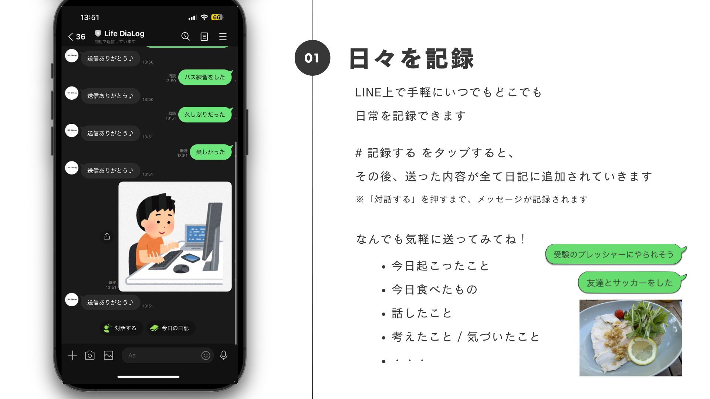

# 日々を記録し, 人生と対話するアプリ 「Life DiaLog」

## 製品概要
### 背景(製品開発のきっかけ、課題等）
高校受験, 大学受験, 就職, 結婚, 転職, 昇進, 退職など, 人生にはさまざまなライフイベントが訪れます. その度に, 人々はこれまでの自分自身を見つめ直し, 決断を下す必要に迫られます.  

そんなときに,

- 過去の自分を手軽に振り返りたい
- 自分の強みや弱み, 自分の考え方の傾向を教えてほしい
- 進路の選択肢をアドバイスしてほしい

という課題があります.

そんな声に応えるため, Life DiaLog を開発しました.

### 製品説明
### 機能一覧

#### 1. 日々の記録: 日常を, いつでもどこでも手軽に記録可能

#### 2. 毎日の記録をフィードバックし, 要約

#### 3. 蓄積されたデータから, 自己分析

#### 4. 人生と対話: 蓄積されたデータから, 自分自身と対話し、人生相談が可能. 検索に最も合った日記の提案も可能.

### 解決出来ること
#### 日々を記録: 日記をより手軽に身近にする
自分自身の体験や感じたことを手軽にいつでもどこでも, テキストや画像で保存できます. 

保存された日記は, あとから振り返ることが可能です.

#### 人生と対話: 人生の振り返り, 人生設計をより手軽に身近にする
日々を記録することで溜まったデータをもとにして, 自己分析をサポートします. ユーザの弱みや強み, ユーザの性格などを客観的に見ることができます.

また, 自分自身の履歴と対話することで, 深い人生の悩みを相談できたり, 対話形式での思い出の検索が可能です. 思い出を検索したときには, 根拠となった日記を提示することで, 手軽に自分の人生を振り返る機会を提供します.

### 今後の展望
#### より豊かな日々の記録
日々の記録をより豊富にビビッドに記録するために, 以下の機能の追加が考えられる.

- 動画, 音声, webリンク, 位置情報の日記に登録が可能
- TwitterやInstagramなどの投稿内容を日記に登録可能
- SpotifyやApple Musicなど, 聞いた音楽を日記に登録可能
- 投稿内容の修正/削除が可能
- 1週間の振り返りおよび画像からアルバム作成機能
- 日記にタグ付けが可能

#### より豊かな人生との対話
自分自身をより高解像度で振り返るために, 以下の機能の追加が考えられる.

- アップロードした内容の統計情報(写真数, 投稿数, 継続日数など)を閲覧可能
- 日々の日記から, 感情の変化をグラフで閲覧可能
- 自身の履歴を登録しておくことで, 履歴書の自動生成が可能

### 注力したこと（こだわり等）
* 圧倒的な使いやすさを意識.
* ハイブリッド検索とRAGを用いることで, テキストから思い出自体の検索が可能に.

## 開発技術
### 活用した技術
#### API・データ
* 
* 

#### フレームワーク・ライブラリ・モジュール
* 
* 

#### デバイス
* 
* 

### 独自技術
#### ハッカソンで開発した独自機能・技術
* 独自で開発したものの内容をこちらに記載してください
* 特に力を入れた部分をファイルリンク、またはcommit_idを記載してください。

- ハイブリッド検索とRAGを用いて, 対話形式で日記を検索することを可能としました.

1. 各日記を文字列およびベクトルとして保存しておく.
2. インプットの質問と, それぞれの形式で比較し, 最も近い日記をいくつか列挙する.
3. その日記をもとにして, LLMの回答を生成する.

- これにより, 質問に自分自身の過去の履歴から答えることができ, さらには, 根拠となった日記を表示することも可能となりました.

